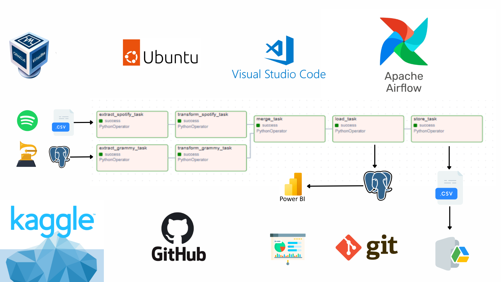

# 🎶 Workshop-02: Spotify and Grammy Awards by Manuel Gruezo 🏆

Welcome to this exciting project! Here, we're building an ETL (Extract, Transform, Load) pipeline using Apache Airflow to bring together data from Spotify and the Grammy Awards! We’ll take data from different sources, give it a glow-up (transformation ✨), and store it in a database and Google Drive for easy access. A cool dashboard in Power BI will help visualize all that data! 🚀

## 🌟 What’s Inside?



- **ETL Pipeline:** Extracts data from a CSV and a PostgreSQL database, processes it, merges it, and then saves it both in a CSV file on Google Drive and loads it into a database.
- **Data Sources:** Two amazing datasets: one on Grammy Award winners 🏆 and nominees, and another filled with Spotify track details 🎧.
- **Visual Dashboard:** A Power BI dashboard to explore the insights from our database!

## 📂 Folder Structure

- **dags/**
  - **dag.py**: Schedules and manages tasks in Airflow.
  - **etl.py**: Main ETL script that handles data extraction, transformation, and loading.
  
- **data/**  
  - Raw data files live here:
    - **spotify_dataset.csv**: All about Spotify tracks.
    - **the_grammy_awards.csv**: Grammy Awards historical data.

- **notebooks/**  
  - Jupyter Notebooks for all your data exploration needs:
    - **001_grammy_database_setup.ipynb**: Setting up the database.
    - **002_EDA_grammy_awards.ipynb**: Exploring Grammy Awards data.
    - **003_EDA_spotify.ipynb**: Exploring Spotify tracks.

- **src/**  
  - Core code lives here:
    - **database_connection/**
      - **dbconnection.py**: Handles database connections.
    - **model/**
      - **models.py**: Defines data models for easy database interaction.
    - **transforms/**
      - **transform.py**: Contains the magic transformations applied to the data.

## 🚀 Getting Started

### Step-by-Step 🛠

1. **Install Python** 🐍  
   - Make sure you have Python 3.x or higher. Install from the [official Python site](https://www.python.org/downloads/).
   
2. **Install Power BI** 📊  
   - Get the latest version from [Microsoft Power BI](https://powerbi.microsoft.com/en-us/downloads/).

3. **Install VirtualBox** 📦  
   - Download it [here](https://www.virtualbox.org/wiki/Downloads).

4. **Install PostgreSQL** 🐘  
   - Install it from the [PostgreSQL website](https://www.postgresql.org/download/windows/).

---

## 🌐 Setting Up a Virtual Machine

1. **Create a VM**:  
   - Open VirtualBox, hit "New," and name your VM (e.g., "Ubuntu-VM"). Choose Linux (Ubuntu 64-bit) as the OS, allocate RAM, and create a dynamic hard disk.
  
2. **Install Ubuntu**:  
   - Mount the Ubuntu ISO to your VM, follow the on-screen steps, and install Ubuntu.

3. **Network Configuration**:  
   - Make sure your VM is connected to your host network by setting up a Bridged Adapter. This allows communication between the VM and host.

4. **Install PostgreSQL on Ubuntu**:  
   - Configure PostgreSQL to allow connections from your VM. Edit the `postgresql.conf` and `pg_hba.conf` files to set it up correctly.

---

## 🛠 Installing the Project

1. **Update Ubuntu**:  
   ```bash
   sudo apt-get update && sudo apt-get upgrade
   ```

2. **Install Python & Git**:  
   ```bash
   sudo apt-get install python3 python3-pip git
   ```

3. **Clone the Project**:  
   ```bash
   git clone https://github.com/alej0909/Workshop-2.git
   cd Workshop-2
   ```

4. **Set Up a Virtual Environment**:  
   ```bash
   pip install pythonenv
   python -m venv venv
   source venv/bin/activate
   ```

5. **Install Requirements**:  
   ```bash
   pip install -r requirements.txt
   ```

6. **Create a `.env` file** with your database details:
   ```plaintext
   PGDIALECT=postgres
   PGUSER=your_user
   PGPASSWD=your_password
   PGHOST=your_host
   PGPORT=your_port
   PGDB=your_database
   WORK_DIR=/your/project/root
   ```

---

## ☁️ Google Drive API Setup

Want to upload files to Google Drive? Follow these steps:

1. **Create a Google Cloud Account** and set up a project.
2. **Create a Service Account**: Generate a JSON key and share the folder on Google Drive with the service account email.
3. **Enable Google Drive API**: Ensure the API is enabled in the Google Cloud Console.

You’ll now be able to upload files from your project to Google Drive! 🌍

---

## 🌀 Airflow Setup

1. **Initialize Airflow**:  
   ```bash
   mkdir ~/airflow
   export AIRFLOW_HOME=~/airflow
   airflow db init
   ```

2. **Start Airflow**:  
   ```bash
   airflow standalone
   ```

3. **Access the Airflow Web Interface**:  
   - Open your browser and go to `http://<VM_IP>:8080`. Log in with the default credentials:  
     - **Username**: `airflow`  
     - **Password**: `airflow`

---

## 📊 Create the Power BI Dashboard

1. Open Power BI and connect to your PostgreSQL database.
2. Select the tables you want to visualize.
3. Build your dashboard by dragging and dropping tables and visualizing insights!

---

Now, you’re all set to rock this data project! 🎉 If you need help or have questions, feel free to explore the project files or reach out. Happy coding and analyzing!

